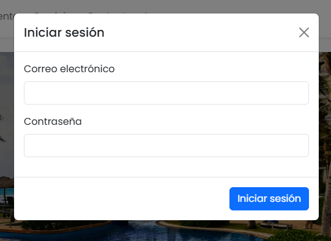
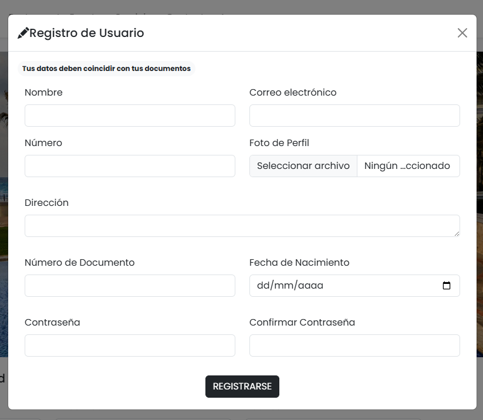
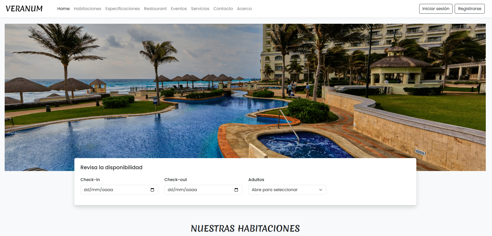
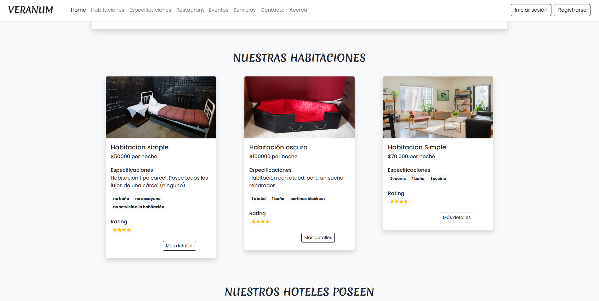
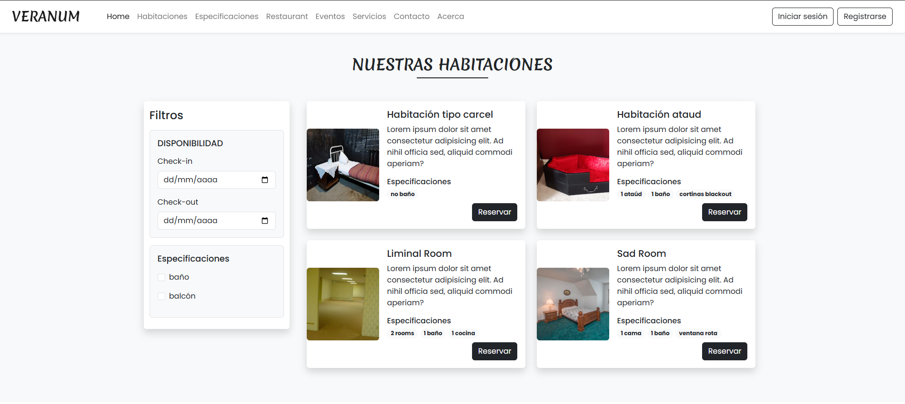
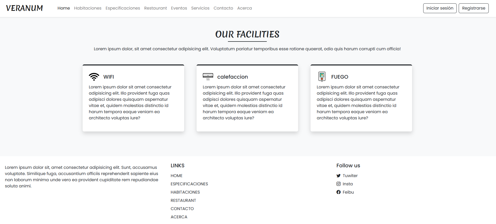
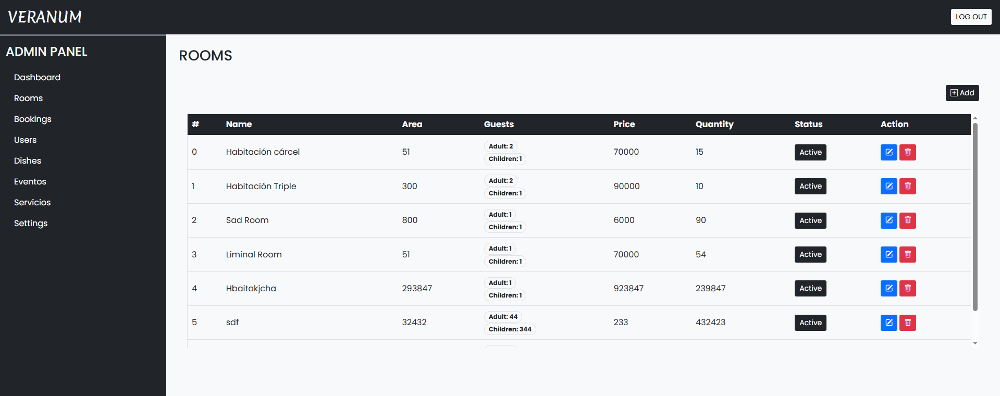
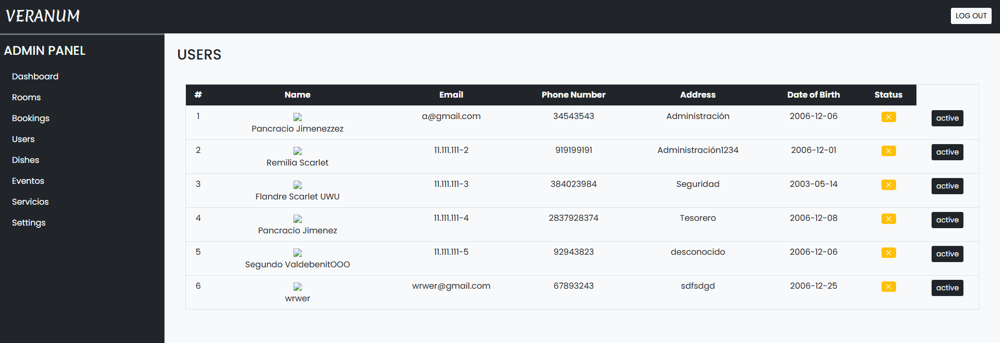

🏨 Proyecto Hotel Veranum - Sistema de Gestión Hotelera
Este proyecto contempla funcionalidades clave para la administración eficiente de un hotel, tanto para usuarios como para el personal administrativo.

---

🔐 Inicio de sesión y Registro
Permite a los usuarios crear una cuenta e iniciar sesión para acceder a funcionalidades personalizadas.

---

🏠 Página principal
Vista principal del sitio con acceso a las funciones del hotel.

---

🛠️ Panel de administración
Zona exclusiva para el personal encargado de la gestión del hotel.

🛏️ Registro de habitaciones
Formulario para añadir nuevas habitaciones disponibles.

🍽️ Registro de restaurante
Módulo para añadir platillos al menú del restaurante.

👥 Vista de usuarios registrados
Listado de los usuarios del sistema, con opciones de gestión.

---

📌 Tecnologías utilizadas
HTML, CSS, JavaScript
PHP
MySQL
